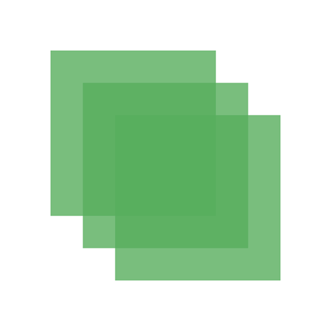

:name: JustLayout
:author: Elias Abel
:author_esc: Elias%20Abel
:mail: admin@meniny.cn
:desc: an elegant Auto Layout sugar for iOS and tvOS
:icon: {name}.png
:version: 1.6.1
:na: N/A
:ios: 8.0
:macos: {na}
:watchos: {na}
:tvos: 10.2
:linux: {na}
:xcode: 10.2
:swift: 5
:license: MIT
:sep: %20%7C%20
:platform: iOS{sep}tvOS
:toclevels: 6
:toc-title: TOC
:source-highlighter: highlightjs
:icons: font
= Meet `{name}`
{author} <{mail}>
v{version}, 2018-05-23

[subs="attributes"]
++++
<p align="center">
  
  <br/><br/>
  
  
  
  <br/>
  
  
  
  <br/>
  
  
  
  
</p>
++++

:toc:

== 🏵 Introduction

**{name}** is {desc}.

== 📋 Requirements

[%header]
|===
2+^m|Type 1+^m|Requirement

1.5+^.^|Platform ^|iOS ^|{ios}+
^|macOS ^|{macos}
^|tvOS ^|{tvos}
^|watchOS ^|{watchos}
^|Linux ^|{linux}

^|IDE ^|Xcode ^| {xcode}+
^|Language ^|Swift ^| {swift}+
|===

== 📲 Installation

=== CocoaPods

`{name}` is available on link:https://cocoapods.org[CocoaPods].

[source, ruby, subs="verbatim,attributes"]
----
use_frameworks!
pod '{name}'

# for DSL usage:
#pod '{name}/DSL
----

=== Manually

Copy all files in the `{name}` directory into your project.

== 🛌 Dependency

{na}

== ❤️ Contribution

You are welcome to fork and submit pull requests.

== 🔖 License

`{name}` is open-sourced software, licensed under the link:./LICENSE.md[`{license}`] license.

== 🔫 Usage

[source, swift, subs="verbatim,attributes"]
----
import {name}
----

=== Visually

[source, swift, subs="verbatim,attributes"]
----
func visually() {
    view.layout(
        100,
        |-topView-| ~ 80,
        8,
        |-centerView-(>=100)-| ~ 80,
        "",
        |bottomView| ~ 80,
        0
    )
}
----

=== Chainable

[source, swift, subs="verbatim,attributes"]
----
func chainable() {
    centerView.centerInContainer().width(100).aspectratio(followHeight: 100%)
    topView.left(centerView, -20).top(centerView, -20).size(centerView)
    bottomView.left(centerView, 20).top(centerView, 20).size(centerView)
}
----



=== Operator-Based

```swift
func operatorBased() {
    bottomView.centerXAttribute == view.centerXAttribute
    bottomView.centerYAttribute == view.centerYAttribute
    bottomView.widthAttribute == 80
    bottomView.heightAttribute == bottomView.widthAttribute

    centerView.rightAttribute == bottomView.centerXAttribute
    centerView.topAttribute == bottomView.centerYAttribute
    centerView.widthAttribute == bottomView.widthAttribute
    centerView.heightAttribute == bottomView.heightAttribute

    topView.leftAttribute == centerView.rightAttribute
    topView.topAttribute == centerView.topAttribute
    topView.widthAttribute == 50 % centerView.widthAttribute
    topView.heightAttribute == centerView.heightAttribute
}
```

[quote]
____
The `Operator-Based` layout is now chainable after version `1.4.0`. For example:

[source, swift]
----
someView.following(leftView).below(topView).size(centerView)
----

[source, swift]
----
someView.leftAttribute == leftView.rightAttribute
someView.topAttribute == topView.bottomAttribute
someView.widthAttribute == centerView.widthAttribute
someView.heightAttribute == centerView.heightAttribute
----
____

=== DSL

After version `1.5.0` you can now use the `JustLayoutDSL`:

[source, swift]
----
centerView.just.centerInContainer().width(100).aspectratio(100%)
topView.just.left(centerView, -20).top(centerView, -20).size(centerView)
bottomView.just.left(centerView, 20).top(centerView, 20).size(centerView)
----

[IMPORTANT]
====
Please add `pod 'JustLayout/DSL' to your `Podfile` first.
====

---

Made with icon:heart[2x] by {author}.
